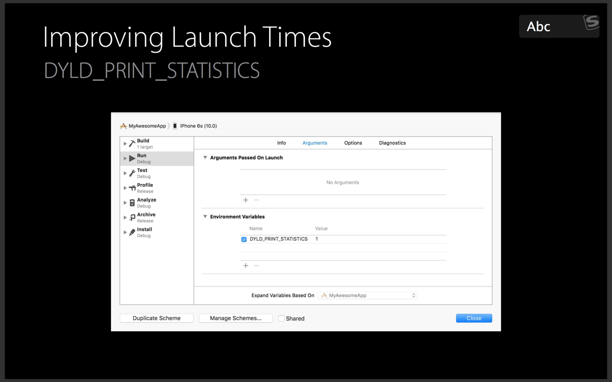

# iOS 启动优化

t(App总启动时间) = t1(main()之前的加载时间) + t2(main()之后的加载时间)  

## 1. t1

t1 = 系统dylib(动态链接库)和自身App可执行文件的加载； 

1. 首先加载可执行文件（自身App的所有.o文件的集合, .a静态库以及bundlde资源） 
2. 加载动态链接库dyld(dyld是一个专门用来加载动态链接库的库).

### 动态链接库加载的具体流程, 步骤具体分为5步：

* load dylibs image 读取库镜像文件
* Rebase&Binding image
* Objc setup
* initializers

1. load dylibs image  
在每个动态库的加载过程中， dyld需要：分析所依赖的动态库, 找到动态库的mach-o文件, 打开文件, 验证文件, 在系统核心注册文件签名, 对动态库的每一个segment调用mmap().

2. rebase/bind
由于ASLR(address space layout randomization)的存在，可执行文件和动态链接库在虚拟内存中的加载地址每次启动都不固定，所以需要这2步来修复镜像中的资源指针，来指向正确的地址。 rebase修复的是指向当前镜像内部的资源指针； 而bind指向的是镜像外部的资源指针。 
rebase步骤先进行，需要把镜像读入内存，并以page为单位进行加密验证，保证不会被篡改，所以这一步的瓶颈在IO。bind在其后进行，由于要查询符号表，来指向跨镜像的资源，加上在rebase阶段，镜像已被读入和加密验证，所以这一步的瓶颈在于CPU计算。 通过命令行可以查看相关的资源指针:

```
xcrun dyldinfo -rebase -bind -lazy_bind myApp.App/myApp
```

3. Objc setup: 
  这一步主要工作是: 注册Objc类 (class registration), 把category的定义插入方法列表 (category registration), 保证每一个selector唯一 (selctor uniquing)

4. initializers
以上三步属于静态调整(fix-up)，都是在修改__DATA segment中的内容，而这里则开始动态调整，开始在堆和堆栈中写入内容。 在这里的工作有：Objc的+load()函数, C++的构造函数属性函数 形如attribute((constructor)) void DoSomeInitializationWork(), 非基本类型的C++静态全局变量的创建(通常是类或结构体)(non-trivial initializer) 比如一个全局静态结构体的构建，如果在构造函数中有繁重的工作，那么会拖慢启动速度

### main()之前的加载时间如何衡量




会有类似以下的输出

```

Total pre-main time: 42.2 seconds (100.0%)
         dylib loading time: 493.50 milliseconds (1.1%)
        rebase/binding time: 699.54 milliseconds (1.6%)
            ObjC setup time: 131.27 milliseconds (0.3%)
           initializer time: 40.9 seconds (96.8%)
           slowest intializers :
                        rninit : 81.0 seconds (191.8%)
```

### 总结

* 动态库： 移除不需要用到的动态库
  
* ObjC类: 移除不需要用的类
```
   http://stackoverflow.com/questions/35233564/how-to-find-unused-code-in-xcode-7
   https://developer.Apple.com/library/ios/documentation/ToolsLanguages/Conceptual/Xcode_Overview/CheckingCodeCoverage.html

   OCLint
```
* C的constructor函数越多，启动越慢
* C++静态对象越多，启动越慢
* ObjC的+load越多，启动越慢
* 图片资源压缩([TinyPNG](https://tinypng.com/developers)) 

## t2

t2 = main方法执行之后到AppDelegate类中的- (BOOL)Application:(UIApplication *)Application didFinishLaunchingWithOptions:(NSDictionary *)launchOptions方法执行结束前这段时间，主要是构建第一个界面，并完成渲染展示。  

t2的优化，主要依据自己的app实际情况而定, 随着业务的不断堆积，每间隔一段时间都会发现APP启动过程，都会隐藏很多不可描述的代码，带有很重的的历史包袱. 因此要耐心分析理解，慢慢找出方案

重点有一下几点考虑

* 首屏页面层次优化
* 启动并发线程优化
* 相关SDK注册选择惰性初始化
* 启动是必要数据加载检查
* 日志打印，准确定位耗时较多的代码


参看文献:

https://techblog.toutiao.com/2017/01/17/iosspeed/

https://mp.weixin.qq.com/s/Kf3EbDIUuf0aWVT-UCEmbA