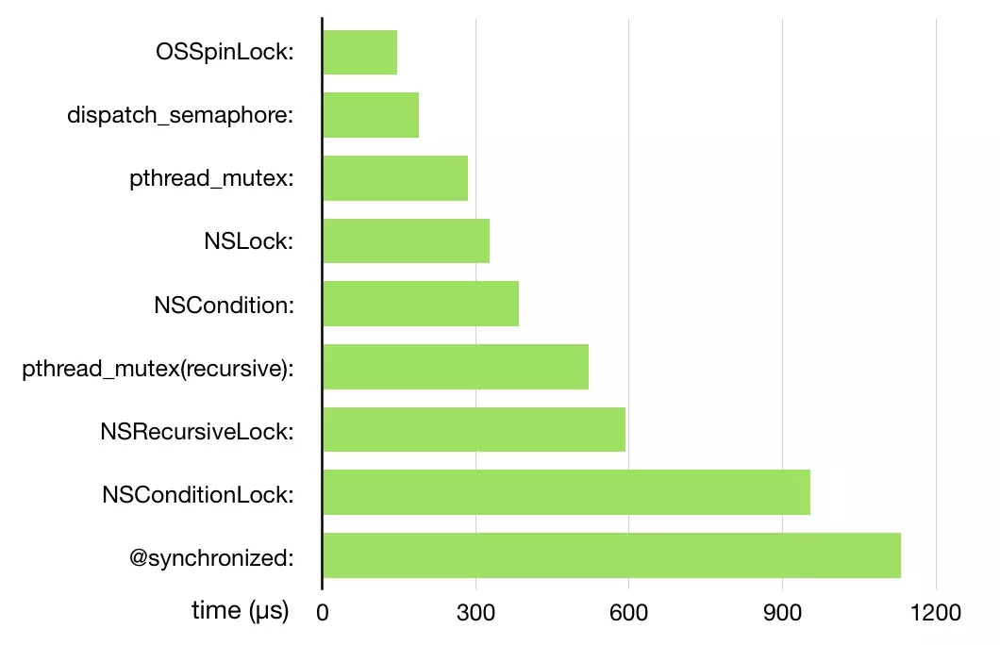

# 线程安全

多线程技术对于计算机开发带来了巨大的性能提升，同样也来带了新的伤痛——线程安全问题。

而对于iOS developer来说，平时开发中时刻注意保证代码安全

## Apple 的框架
首先让我们来看看 Apple 的框架。一般来说除非特别声明，大多数的类默认都不是线程安全的。对于其中的一些类来说，这是很合理的，但是对于另外一些来说就很有趣了。

就算是在经验丰富的 iOS/Mac 开发者，也难免会犯从后台线程去访问 UIKit/AppKit 这种错误。比如因为图片的内容本身就是从后台的网络请求中获取的话，顺手就在后台线程中设置了 image 之类的属性，这样的错误其实是屡见不鲜的。Apple 的代码都经过了性能的优化，所以即使你从别的线程设置了属性的时候，也不会产生什么警告。

在设置图片这个例子中，症结其实是你的改变通常要过一会儿才能生效。但是如果有两个线程在同时对图片进行了设定，那么很可能因为当前的图片被释放两次，而导致应用崩溃。这种行为是和时机有关系的，所以很可能在开发阶段没有崩溃，但是你的用户使用时却不断 crash。


最新的xcode提供主线程渲染工具[UIKit, APPKit主线程渲染的检查](https://developer.apple.com/documentation/code_diagnostics/main_thread_checker)，
另外我们确实有一些技巧来避免这个问题。[UIKit Main Thread Guard](https://gist.github.com/steipete/5664345) 是一段用来监视每一次对 setNeedsLayout 和 setNeedsDisplay 的调用代码，并检查它们是否是在主线程被调用的。因为这两个方法在 UIKit 的 setter （包括 image 属性）中广泛使用，所以它可以捕获到很多线程相关的错误。虽然这个小技巧并不包含任何私有 API， 但我们还是不建议将它是用在发布产品中，不过在开发过程中使用的话还是相当赞的。

Apple没有把 UIKit 设计为线程安全的类是有意为之的，将其打造为线程安全的话会使很多操作变慢。而事实上 UIKit 是和主线程绑定的，这一特点使得编写并发程序以及使用 UIKit 十分容易的，你唯一需要确保的就是对于 UIKit 的调用总是在主线程中来进行。

## 为什么 UIKit 不是线程安全的？
对于一个像 UIKit 这样的大型框架，确保它的线程安全将会带来巨大的工作量和成本。将 non-atomic 的属性变为 atomic 的属性只不过是需要做的变化里的微不足道的一小部分。通常来说，你需要同时改变若干个属性，才能看到它所带来的结果。为了解决这个问题，苹果可能不得不提供像 Core Data 中的 performBlock: 和 performBlockAndWait: 那样类似的方法来同步变更。另外你想想看，绝大多数对 UIKit 类的调用其实都是以配置为目的的，这使得将 UIKit 改为线程安全这件事情更显得毫无意义了。

然而即使是那些与配置共享的内部状态之类事情无关的调用，其实也不是线程安全的。如果你做过 iOS 3.2 或之前的黑暗年代的 app 开发的话，你肯定有过一边在后台准备图像时一边使用 NSString 的 drawInRect:withFont: 时的随机崩溃的经历。值得庆幸的事，在 iOS 4 中 苹果将大部分绘图的方法和诸如 UIColor 和 UIFont 这样的类改写为了后台线程可用。

但不幸的是 Apple 在线程安全方面的文档是极度匮乏的。他们推荐只访问主线程，并且甚至是绘图方法他们都没有明确地表示保证线程安全。因此在阅读文档的同时，去读读 iOS 版本更新说明会是一个很好的选择。

对于大多数情况来说，UIKit 类确实只应该用在应用的主线程中。这对于那些继承自 UIResponder 的类以及那些操作你的应用的用户界面的类来说，不管如何都是很正确的。


## 内存回收 (deallocation) 问题
另一个在后台使用 UIKit 对象的的危险之处在于“内存回收问题”。Apple 在技术笔记 TN2109 中概述了这个问题，并提供了多种解决方案。这个问题其实是要求 UI 对象应该在主线程中被回收，因为在它们的 dealloc 方法被调用回收的时候，可能会去改变 view 的结构关系，而如我们所知，这种操作应该放在主线程来进行。

因为调用者被其他线程持有是非常常见的（不管是由于 operation 还是 block 所导致的），这也是很容易犯错并且难以被修正的问题。在 AFNetworking 中也一直长久存在这样的 bug，但是由于其自身的隐蔽性而鲜为人知，也很难重现其所造成的崩溃。在异步的 block 或者操作中一致使用 __weak，并且不去直接访问局部变量会对避开这类问题有所帮助。


## Collection 类
Apple 有一个针对 iOS 和 Mac 的很好的总览性文档，为大多数基本的 foundation 类列举了其[线程安全](https://developer.apple.com/library/archive/documentation/Cocoa/Conceptual/Multithreading/ThreadSafetySummary/ThreadSafetySummary.html)特性。总的来说，比如 NSArry 这样不可变类是线程安全的。然而它们的可变版本，比如 NSMutableArray 是线程不安全的。事实上，如果是在一个队列中串行地进行访问的话，在不同线程中使用它们也是没有问题的。要记住的是即使你申明了返回类型是不可变的，方法里还是有可能返回的其实是一个可变版本的 collection 类。一个好习惯是写类似于 return [array copy] 这样的代码来确保返回的对象事实上是不可变对象。

与和Java这样的语言不一样，Foundation 框架并不提供直接可用的 collection 类，这是有其道理的，因为大多数情况下，你想要的是在更高层级上的锁，以避免太多的加解锁操作。但缓存是一个值得注意的例外，iOS 4 中 Apple 添加的 NSCache 使用一个可变的字典来存储不可变数据，它不仅会对访问加锁，更甚至在低内存情况下会清空自己的内容。

也就是说，在你的应用中存在可变的且线程安全的字典是可以做到的。借助于 class cluster 的方式，我们也很容易写出这样的代码。

# 保证线程安全

## 为何不用 @synchronized ？
你也许会想问为什么苹果不用 @synchronized(self) 这样一个已经存在的运行时特性来锁定属？？你可以看看这里的源码，就会发现其实发生了很多的事情。Apple 使用了最多三个加/解锁序列，还有一部分原因是他们也添加了异常开解(exception unwinding)机制。相比于更快的自旋锁方式，这种实现要慢得多。由于设置某个属性一般来说会相当快，因此自旋锁更适合用来完成这项工作。@synchonized(self) 更适合使用在你 需要确保在发生错误时代码不会死锁，而是抛出异常的时候。

## 实现线程安全两个通用的tips:

* 不要有可变的共享状态
* 如果可变的共享状态不可避免，那么就需要保证线程安全  

## 原子性

单独使用原子属性并不会使你的类变成线程安全。它不能保护你应用的逻辑，只能保护你免于在 setter 中遭遇到竞态条件的困扰。

你曾经好奇过 Apple 是怎么处理 atomic 的设置/读取属性的么？至今为止，你可能听说过自旋锁 (spinlocks)，信标 (semaphores)，锁 (locks)，@synchronized 等，Apple 用的是什么呢？因为 Objctive-C 的 runtime 是开源的，所以我们可以一探究竟。

一个非原子的 setter 看起来是这个样子的：
```Objc
- (void)setUserName:(NSString *)userName {
      if (userName != _userName) {
          [userName retain];
          [_userName release];
          _userName = userName;
      }
}
```
这是一个手动 retain/release 的版本，ARC 生成的代码和这个看起来也是类似的。当我们看这段代码时，显而易见要是 setUserName: 被并发调用的话会造成麻烦。我们可能会释放 _userName 两次，这回使内存错误，并且导致难以发现的 bug。

对于任何没有手动实现的属性，编译器都会生成一个 objc_setProperty_non_gc(id self, SEL _cmd, ptrdiff_t offset, id newValue, BOOL atomic, signed char shouldCopy) 的调用。在我们的例子中，这个调用的参数是这样的：
```Objc
objc_setProperty_non_gc(self, _cmd, 
  (ptrdiff_t)(&_userName) - (ptrdiff_t)(self), userName, NO, NO);`
```
ptrdiff_t 可能会吓到你，但是实际上这就是一个简单的指针算术，因为其实 Objective-C 的类仅仅只是 C 结构体而已。

objc_setProperty 调用的是如下方法：
```Objc
static inline void reallySetProperty(id self, SEL _cmd, id newValue, 
  ptrdiff_t offset, bool atomic, bool copy, bool mutableCopy) 
{
    id oldValue;
    id *slot = (id*) ((char*)self + offset);

    if (copy) {
        newValue = [newValue copyWithZone:NULL];
    } else if (mutableCopy) {
        newValue = [newValue mutableCopyWithZone:NULL];
    } else {
        if (*slot == newValue) return;
        newValue = objc_retain(newValue);
    }

    if (!atomic) {
        oldValue = *slot;
        *slot = newValue;
    } else {
        spin_lock_t *slotlock = &PropertyLocks[GOODHASH(slot)];
        _spin_lock(slotlock);
        oldValue = *slot;
        *slot = newValue;        
        _spin_unlock(slotlock);
    }

    objc_release(oldValue);
}
```
除开方法名字很有趣以外，其实方法实际做的事情非常直接，它使用了在 PropertyLocks 中的 128 个自旋锁中的 1 个来给操作上锁。这是一种务实和快速的方式，最糟糕的情况下，如果遇到了哈希碰撞，那么 setter 需要等待另一个和它无关的 setter 完成之后再进行工作。

```Objc
@property (nonatomic, readwrite, strong) IBOutlet UILabel *nameLabel;
@property (atomic, readwrite, strong) IBOutlet UILabel *otherLabel;
```
UIKit容许UI元素在主线程上渲染，因此在UIKit元素中设置原子性是不妥的，自旋锁会带一些额外的性能问题


## 可行的线程安全设计
在尝试写一些线程安全的东西之前，应该先想清楚是不是真的需要。确保你要做的事情不会是过早优化。如果要写的东西是一个类似配置类 (configuration class) 的话，去考虑线程安全这种事情就毫无意义了。更正确的做法是扔一个断言上去，以保证它被正确地使用：
```Objc
void PSPDFAssertIfNotMainThread(void) {
    NSAssert(NSThread.isMainThread, 
      @"Error: Method needs to be called on the main thread. %@", 
      [NSThread callStackSymbols]);
}
```
对于那些肯定应该线程安全的代码（一个好例子是负责缓存的类）来说，一个不错的设计是使用并发的 dispatch_queue 作为读/写锁，并且确保只锁着那些真的需要被锁住的部分，以此来最大化性能。一旦你使用多个队列来给不同的部分上锁的话，整件事情很快就会变得难以控制了。

于是你也可以重新组织你的代码，这样某些特定的锁就不再需要了。看看下面这段实现了一种多委托的代码（其实在大多数情况下，用 NSNotifications 会更好，但是其实也还是有多委托的实用例子）的
````Objc
// 头文件
@property (nonatomic, strong) NSMutableSet *delegates;

// init方法中
_delegateQueue = dispatch_queue_create("com.PSPDFKit.cacheDelegateQueue", 
  DISPATCH_QUEUE_CONCURRENT);

- (void)addDelegate:(id<PSPDFCacheDelegate>)delegate {
    dispatch_barrier_async(_delegateQueue, ^{
        [self.delegates addObject:delegate];
    });
}

- (void)removeAllDelegates {
    dispatch_barrier_async(_delegateQueue, ^{
        self.delegates removeAllObjects];
    });
}

- (void)callDelegateForX {
    dispatch_sync(_delegateQueue, ^{
        [self.delegates enumerateObjectsUsingBlock:^(id<PSPDFCacheDelegate> delegate, NSUInteger idx, BOOL *stop) {
            // 调用delegate
        }];
    });
}
```
除非 addDelegate: 或者 removeDelegate: 每秒要被调用上千次，否则我们可以使用一个相对简洁的实现方式：

```Objc
// 头文件
@property (atomic, copy) NSSet *delegates;

- (void)addDelegate:(id<PSPDFCacheDelegate>)delegate {
    @synchronized(self) {
        self.delegates = [self.delegates setByAddingObject:delegate];
    }
}

- (void)removeAllDelegates {
    @synchronized(self) {
        self.delegates = nil;
    }
}

- (void)callDelegateForX {
    [self.delegates enumerateObjectsUsingBlock:^(id<PSPDFCacheDelegate> delegate, NSUInteger idx, BOOL *stop) {
        // 调用delegate
    }];
}
```
就算这样，这个例子还是有点理想化，因为其他人可以把变更限制在主线程中。但是对于很多数据结构，可以在可变更操作的方法中创建不可变的拷贝，这样整体的代码逻辑上就不再需要处理过多的锁了。

GCD 的陷阱
对于大多数上锁的需求来说，GCD 就足够好了。它简单迅速，并且基于 block 的 API 使得粗心大意造成非平衡锁操作的概率下降了不少。然后，GCD 中还是有不少陷阱，我们在这里探索一下其中的一些。

将 GCD 当作递归锁使用
GCD 是一个对共享资源的访问进行串行化的队列。这个特性可以被当作锁来使用，但实际上它和 @synchronized 有很大区别。 GCD队列并非是可重入的，因为这将破坏队列的特性。很多有试图使用 dispatch_get_current_queue() 来绕开这个限制，但是这是一个糟糕的做法，Apple 在 iOS6 中将这个方法标记为废弃，自然也是有自己的理由。

```Objc
// This is a bad idea.
inline void pst_dispatch_sync_reentrant(dispatch_queue_t queue, 
  dispatch_block_t block) 
{
    dispatch_get_current_queue() == queue ? block() 
                                          : dispatch_sync(queue, block);
}
```
对当前的队列进行测试也许在简单情况下可以行得通，但是一旦你的代码变得复杂一些，并且你可能有多个队列在同时被锁住的情况下，这种方法很快就悲剧了。一旦这种情况发生，几乎可以肯定的是你会遇到死锁。当然，你可以使用 dispatch_get_specific()，这将截断整个队列结构，从而对某个特定的队列进行测试。要这么做的话，你还得为了在队列中附加标志队列的元数据，而去写自定义的队列构造函数。嘛，最好别这么做。其实在实用中，使用 NSRecursiveLock 会是一个更好的选择。

用 dispatch_async 修复时序问题
在使用 UIKit 的时候遇到了一些时序上的麻烦？很多时候，这样进行“修正”看来非常完美：

```Objc
dispatch_async(dispatch_get_main_queue(), ^{
    // Some UIKit call that had timing issues but works fine 
    // in the next runloop.
    [self updatePopoverSize];
});
```
千万别这么做！相信我，这种做法将会在之后你的 app 规模大一些的时候让你找不着北。这种代码非常难以调试，并且你很快就会陷入用更多的 dispatch 来修复所谓的莫名其妙的"时序问题"。审视你的代码，并且找到合适的地方来进行调用（比如在 viewWillAppear 里调用，而不是 viewDidLoad 之类的）才是解决这个问题的正确做法。我在自己的代码中也还留有一些这样的 hack，但是我为它们基本都做了正确的文档工作，并且对应的 issue 也被一一记录过。

记住这不是真正的 GCD 特性，而只是一个在 GCD 下很容易实现的常见反面模式。事实上你可以使用 performSelector:afterDelay: 方法来实现同样的操作，其中 delay 是在对应时间后的 runloop。

在性能关键的代码中混用 dispatch_sync 和 dispatch_async
这个问题我花了好久来研究。在 PSPDFKit 中有一个使用了 LRU（最久未使用）算法列表的缓存类来记录对图片的访问。当你在页面中滚动时，这个方法将被调用非常多次。最初的实现使用了 dispatch_sync 来进行实际有效的访问，使用 dispatch_async 来更新 LRU 列表的位置。这导致了帧数远低于原来的 60 帧的目标。

当你的 app 中的其他运行的代码阻挡了 GCD 线程的时候，dispatch manager 需要花时间去寻找能够执行 dispatch_async 代码的线程，这有时候会花费一点时间。在找到合适的执行线程之前，你的同步调用就会被 block 住了。其实在这个例子中，异步情况的执行顺序并不是很重要，但没有能将这件事情告诉 GCD 的好办法。读/写锁这里并不能起到什么作用，因为在异步操作中基本上一定会需要进行顺序写入，而在此过程中读操作将被阻塞住。如果误用了 dispatch_async 代价将会是非常惨重的。在将它用作锁的时候，一定要非常小心。

## 使用 dispatch_async 来派发内存敏感的操作
我们已经谈论了很多关于 NSOperations 的话题了，一般情况下，使用这个更高层级的 API 会是一个好主意。当你要处理一段内存敏感的操作的代码块时，这个优势尤为突出、

在 PSPDFKit 的老版本中，我用了 GCD 队列来将已缓存的 JPG 图片写到磁盘中。当 retina 的 iPad 问世之后，这个操作出现了问题。ß因为分辨率翻倍了，相比渲染这张图片，将它编码花费的时间要长得多。所以，操作堆积在了队列中，当系统繁忙时，甚至有可能因为内存耗尽而崩溃。

我们没有办法追踪有多少个操作在队列中等待运行（除非你手动添加了追踪这个的代码），我们也没有现成的方法来在接收到低内存通告的时候来取消操作、这时候，切换到 NSOperations 可以使代码变得容易调试得多，并且允许我们在不添加手动管理的代码的情况下，做到对操作的追踪和取消。

当然也有一些不好的地方，比如你不能在你的 NSOperationQueue 中设置目标队列（就像 DISPATCH_QUEUE_PRIORITY_BACKGROUND 之于 缓速 I/O 那样）。但这只是为了可调试性的一点小代价，而事实上这也帮助你避免遇到优先级反转的问题。我甚至不推荐直接使用已经包装好的 NSBlockOperation 的 API，而是建议使用一个 NSOperation 的真正的子类，包括实现其 description。诚然，这样做工作量会大一些，但是能输出所有运行中/准备运行的操作是及其有用的。

## 锁

* 互斥锁

互斥锁应当是排它的，意思是锁在被某个线程获取之后，只有获取锁的线程才能释放这个锁。其他线程必须等到获取锁的线程不再拥有锁之后，才能继续执行。在我使用NSLock的测试中，发现可以unlock其他线程的锁，因此严格来说NSLock并不适合被称作互斥锁

* 信号量

信号量拥有比互斥锁更多的用途。当信号量的value大于0时，所有的线程都能访问临界资源。在线程进入临界区后，value减一，反之亦然。如果信号量初始化为0时，可以看做是等待任务执行完成而非资源保护。value的操作应当是采用原子操作来保证指令的安全性的

* 锁性能比较

dispatch_semaphore 信号量[这是一个很好的选择]
OSSpinLock 自旋锁
NSRecursiveLock 递归锁
NSConditionLock 条件锁




## OSSpinLock 的问题

新版 iOS 中，系统维护了 5 个不同的线程优先级/QoS: background，utility，default，user-initiated，user-interactive。高优先级线程始终会在低优先级线程前执行，一个线程不会受到比它更低优先级线程的干扰。这种线程调度算法会产生潜在的优先级反转问题，从而破坏了 spin lock。

具体来说，如果一个低优先级的线程获得锁并访问共享资源，这时一个高优先级的线程也尝试获得这个锁，它会处于 spin lock 的忙等状态从而占用大量 CPU。此时低优先级线程无法与高优先级线程争夺 CPU 时间，从而导致任务迟迟完不成、无法释放 lock。这并不只是理论上的问题，libobjc 已经遇到了很多次这个问题了，于是苹果的工程师停用了 OSSpinLock。

苹果工程师 Greg Parker 提到，对于这个问题，一种解决方案是用 truly unbounded backoff 算法，这能避免 livelock 问题，但如果系统负载高时，它仍有可能将高优先级的线程阻塞数十秒之久；另一种方案是使用 handoff lock 算法，这也是 libobjc 目前正在使用的。锁的持有者会把线程 ID 保存到锁内部，锁的等待者会临时贡献出它的优先级来避免优先级反转的问题。理论上这种模式会在比较复杂的多锁条件下产生问题，但实践上目前还一切都好。

libobjc 里用的是 Mach 内核的 thread_switch() 然后传递了一个 mach thread port 来避免优先级反转，另外它还用了一个私有的参数选项，所以开发者无法自己实现这个锁。另一方面，由于二进制兼容问题，OSSpinLock 也不能有改动。

最终的结论就是，除非开发者能保证访问锁的线程全部都处于同一优先级，否则 iOS 系统中所有类型的自旋锁都不能再使用了。

## barrier


